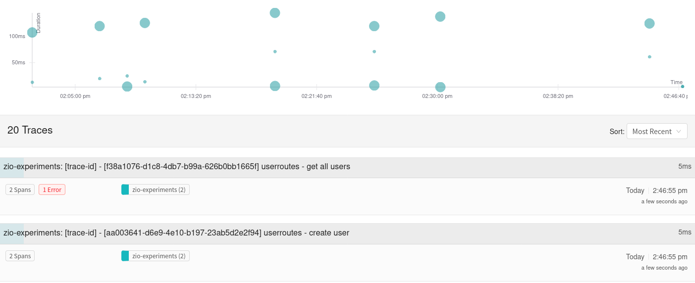
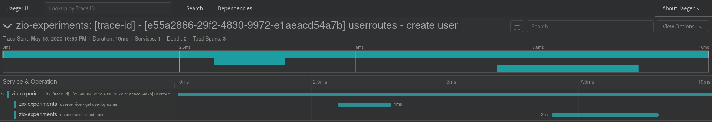
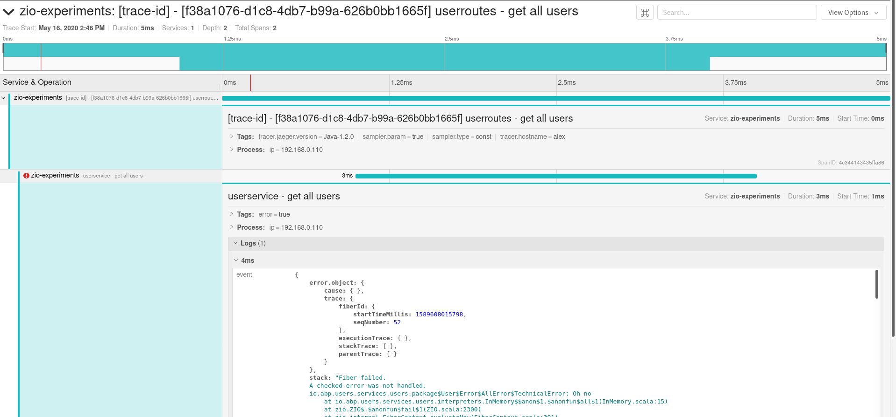

[](https://codeclimate.com/github/alexbalonperin/zio_experiments/maintainability)
[](https://travis-ci.org/alexbalonperin/zio_experiments)
[](https://codecov.io/gh/alexbalonperin/zio_experiments)
[![Mergify Status][mergify-status]][mergify]
[](https://scala-steward.org)

[mergify]: https://mergify.io
[mergify-status]: https://img.shields.io/endpoint.svg?url=https://gh.mergify.io/badges/alexbalonperin/zio_experiments&style=flat


# ZIO Experiments

Trying out ZIO

## Structure

The users folder contains the users service project.
The folder tree looks as follows:

```
users
├── config
│   └── AppConfig.scala
├── domain
│   └── User.scala
├── effects
│   └── idGenerator.scala
├── interfaces
│   └── http
│       ├── SystemRoutes.scala
│       └── UsersRoutes.scala
├── Main.scala
├── modules
│   ├── Logger.scala
├── programs
│   └── UserProgram.scala
└── services
    └── users
        ├── interpreters
        └── UserService.scala
```

#### Config
The config package contains all configurations for the microservice including api parameters, client libraries, logging, telemetry tracer, etc.

#### Domain
The domain package contains objects that are relevant for the internal domain of the microservice.
Domain-driven design (DDD) is a way to structure code to match a business domain (in this case users).
Domain objects are encoding of entities for the specifc domain represented by the microservice (e.g. users).

#### Effects
The effects package contains ZIO effects that extend the library provided set of effects (e.g. random, clock, etc).

For example, IdGenerator is a new effect with a custom implementation to generate entity ids.

#### Interfaces
The interfaces package contains inbound interfaces to the external world (external from the microservice point of view).
For example, http interfaces can contain REST API routes or GraphQL routes.
Another example would be kafka consumers which take input from a kafka topic and process them internally.

This package also contains things like protocol definition, parsing of the requests/events, error conversion from the internal errors to errors that are relevant to clients of the microservice, etc.

#### Modules
The modules package contains the code to instantiate the components (also called object dependencies) of the microservice.
This package assumes that the dependency injection technique.

For example, if your application depends on a Logger (Logging interface), the module package is where you would decide what specific logger is needed.
In this case, the Logger module builds a Logger effect implementing the Logging interface provided by `zio-logging`. For a live Logger, the module builds a Logger with Slf4j format. For a mock Logger, the module builds a Logger printing to the console.

There could be modules to instantiate a kafka consumer/publisher, an http client, a tracer, an http server, etc.

#### Programs
The programs package contains the business or domain logic of the microservice.
The business logic is constructed using building blocks (called services) that are combined to define business rules.

For example, a (very simple) business rule could be "only create users if there is no user with the same name".
Notice that the above statement is very much dependent on the specific business need and would not necessarily apply to another business.
In its simplest form, the above business rule would be translate into a program as follows:

```scala
def createUser(name: String): F[ProgramError Either User.Id]
  for {
    result <- getUsersByName(name)
    user <-
      if (result.isEmpty) createUser(name)
      else fail(ProgramError.UserAlreadyExists)
  } yield user.id
```

There are two building blocks in the above example:
- getUsersByName
- createUser

They could be part of the same service or two different services interfaces.

Programs are called inside the interfaces package. A single program can be used both to process requests from an http api and events from a kafka consumers if both interfaces receive the same data. They are very important and quite difficult to get right as they provide the business functionalities of the microservice. When writing a new microservice, I usually start by designing the programs as well as the inbound interfaces (e.g. http, kafka, etc) and leave the implementations of services for last. Programs allow developers to think in terms of building blocks and simplify greatly the mental overhead when designing a new microservice.

#### Services
The services package contains the building blocks for the programs.
They usually wrap a client library to communicate with an external microservice, a remote datastorage, a local datastorage, etc.

For example, the user service provides the following interface that can be used as building blocks of our business logic:
```scala
trait Service[F[_, _]] {
  def all: F[AllError, List[User]]
  def get(id: User.Id): F[GetError, Option[User]]
  def getByName(name: String): F[GetByNameError, List[User]]
  def create(name: String): F[CreateError, User]
}
```

Each service has an interpreters folder containing the implementations of the service interface.

For example, we can create the following interpreters:
- DefaultInterpreter or LiveInterpreter: This is the interpreter where the actual implementation for the building blocks live.
- LoggingInterpreter: Add logging statements for success and failure of the underlying interpreter method calls.
- MonitoringInterpreter: Add statements to send events to our monitoring tools based on success/failure of the underlying calls.
- TracingInterpreter: Add statements to trace the underlying calls in order to get information about function latency and flame graphs.
- RetryInterpreter: Add retry policy and retry functionality to the underlying calls.

The delegate pattern is used for all but the DefaultInterpreter. All other interpreters wrap an underlying interpreter implementing the service interface.

For example, here is the UserService module:
```scala
def userService(usersRef: Ref[Map[User.Id, User]]) =
  UserService.tracing(UserService.logging(UserService.inMemory(usersRef)))
```

The DefaultInterpreter is void of all the boilerplate needed to make our service production ready (logging, tracing, monitoring, etc).
This has the benefits of making the actual implementation easy to read, making the code flexible and easy to test. The flexibility comes from the fact that if we wanted to remove the retry behavior, we could simply remove the retry interpreter wrap in the module. This is much nicer than passing a mock implementation of the retry function.

Note: For testing, we could also provide mock implementation for the boilerplate instead of wrappers but I personally find the readability benefit to be worth the little extra effort.

Error management is vast topic.
In this service, I have decided to drill down to the lowest layer. Each function has a sealed trait of errors that can be returned. Although this approach requires some extra effort, it makes it very clear what errors can be expected when calling a specific function of the service,
These errors are then converted to ProgramErrors at the program level. The reason for this design decision is to make each internal service a completely independent entity that could be ripped off and become a remote service if need be.

If the errors were defined at the service level, all function calls would have to handle all these errors even though they might not ever happen in a specific function. Of course, I am assuming that we are following the good practice of defining all potential errors as a sealed trait.

For example, if the service had the following errors and following interface:
```scala
sealed trait UserServiceError extends Throwable
object UserServiceError {
  case object NotFound extends UserServiceError
  case object UserAlreadyExists extends UserServiceError
}

trait UserService[F[_]] {
  def get(id: User.Id): F[UserServiceError Either Option[User]]
  def create(name: User.Name): F[USerServiceError Either Unit]
}
```

The caller would have to handle `UserAlreadyExists` when calling `get` even though `get` would never return such error. Similarly, `NotFound` would have to be handled when calling `create`.

One of the nice things about ZIO (vs cats effect) is the ability to have typed errors within the effect context (in this case ZIO).
With cats effect, there was always a debate about what type of errors belong on the Left side of the `Either` and what type of errors belong in the `F` context. As `MonadError` only supports `Throwable` as an error type, there was no way to pattern match on specific errors (e.g. `UserServiceError`) captured by the `F` context. The consensus was to put technical error types inside the `F` context which also captures any exception thrown by underlying libraries and to put business errors (e.g. `UserServiceError`) on the Left side of `Either`. Technically, it is possible to put all errors inside the F context using `F.raiseError(UserServiceError.NotFound)`

ZIO changed that by creating a bifunctor that accepts an error with user-defined type E and a success type A.

#### Main
The Main.scala file is where all the modules are called to start all the components of the application.

## Local development

Run the project locally:
```bash
sbt reStart
```

To use telemetry locally,
- Change the `TELEMETRY_ENABLED` variable to true in `.envrc`
- Reload direnv with: `direnv allow` (if you are in sbt, you need to exit, execute direnv and restart sbt)
- start [Jaeger][jaeger] by running following command:
```bash
docker run -d --name jaeger \
  -e COLLECTOR_ZIPKIN_HTTP_PORT=9411 \
  -p 5775:5775/udp \
  -p 6831:6831/udp \
  -p 6832:6832/udp \
  -p 5778:5778 \
  -p 16686:16686 \
  -p 14268:14268 \
  -p 9411:9411 \
  jaegertracing/all-in-one:1.6
```

To check if it's running properly visit [Jaeger UI](http://localhost:16686/).
More info can be found [here][jaeger-docker].

Traces should look like the following:



